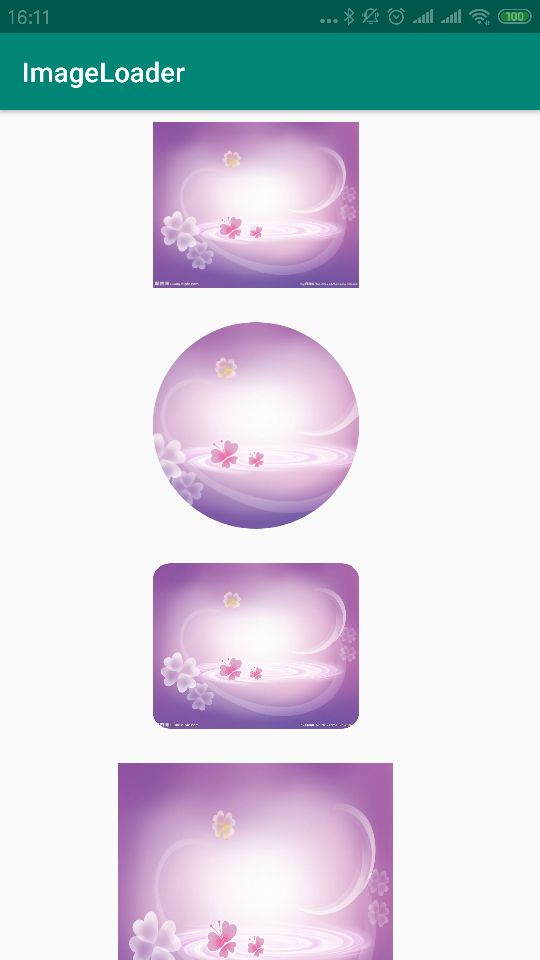

# imageloader
图片加载类，加载正常、圆形、圆角图片

#引入

#使用方式
```
private ImageView iv, ivCircle, ivRadius;
private View view;
String url = "https://timgsa.baidu.com/xxx.jpg";
IImageLoader imageLoader = ImageLoaderFactory.getInstance();
imageLoader.displayImage(iv, url);
imageLoader.displayCircleImage(ivCircle, url);
imageLoader.displayRadiusImage(ivRadius, url, 30);
imageLoader.displayImage(view, url);
```

#运行结果

